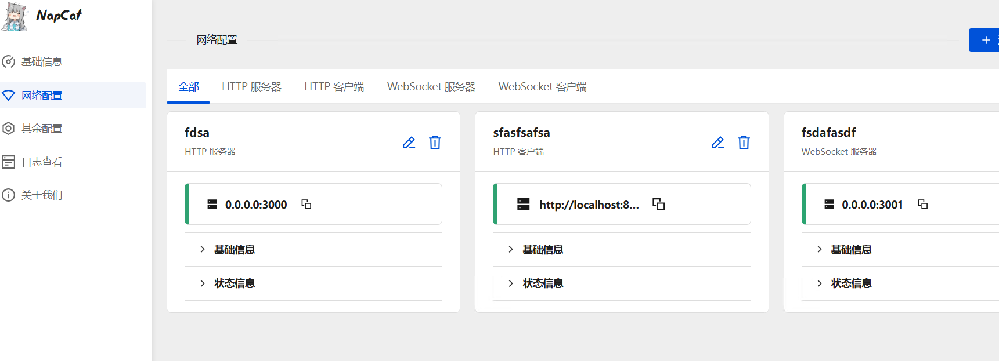
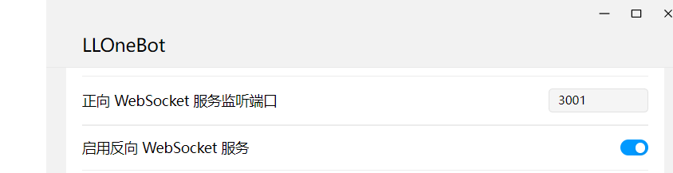
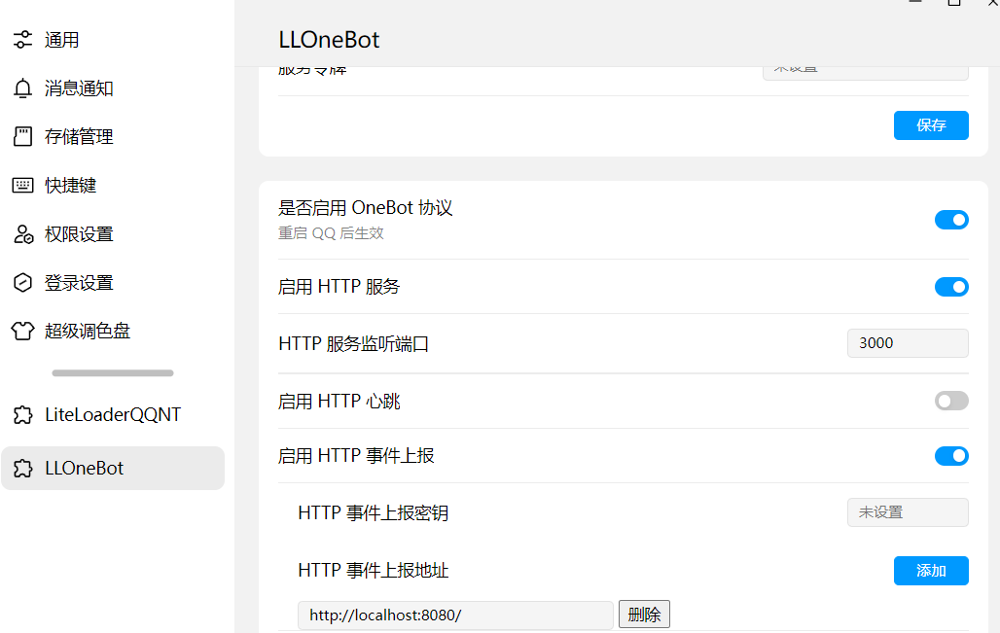

# 部署
后续会发布专门的部署工具

## onebot实现与适配器配置(先看后面的搭建部分)
**ws适配器和http适配器二选一。如果你是普通用户，请配置【ws适配器】。**

使用ws适配器时，需要开启onebot实现的正向websocket服务。

使用http适配器时，需要同时开启onebot实现的http服务端功能和http客户端功能。
### 先看看Eridanus的配置文件
Eridanus/config/basic_config.yaml
```yaml
#配置文件预览，你打开之后应该长这样。
bot:
  name: "Eridanus"
master:
  name: "主人"
  id: 1840094972
adapter:
  access_token: "any_access_token" #onebot实现部分为空则不用改
  http_sever:       #bot的运行端口，onebot的事件上报到这里
    host: "0.0.0.0"
    port: 8080
  http_client:
    url: "http://127.0.0.1:3000"  #bot发送的http请求地址。即onebot实现的http sever地址
  ws_client:
    ws_link: "ws://127.0.0.1:3001"  #bot的websocket请求地址
```
一般来说，改改bot的名字和master信息得了。剩下都是onebot默认配置。
### 使用ws适配器
```yaml
adapter:
  #其他配置项暂且省略，这不意味着你可以随便删除别的配置项。
  access_token: "any_access_token" #onebot实现部分为空则不用改
  ws_client:
    ws_link: "ws://127.0.0.1:3001"
```
#### 以napcat为例

`点添加配置时，不要忘了点击【启用】`

如上图最右侧，开启了ws服务器，端口为3001
#### 以llob为例

### 使用http适配器
```yaml
adapter:
  #其他配置项暂且省略，这不意味着你可以随便删除别的配置项。
  access_token: "any_access_token" #onebot实现部分为空则不用改
  http_sever:       #bot的运行端口，onebot的事件上报到这里
    host: "0.0.0.0"
    port: 8080
  http_client:
    url: "http://127.0.0.1:3000" 
```
如上图的napcat，onebot实现的http服务器在3000端口

而上报地址为
```yaml
http://localhost:8080
```
#### 以napcat为例

`点添加配置时，不要忘了点击【启用】`

用http适配器时，第三个可以不用配置。
#### 以llob为例

## 用部署工具搭建
`没做呢`
## 不用部署工具搭建
### 克隆仓库 
确保你已经安装了【git】，找一个你喜欢的目录，在该文件夹打开cmd。

从以下几条指令选一条输入
```yaml
git clone --depth 1 https://github.com/avilliai/Eridanus.git
或使用镜像源
git clone --depth 1 https://mirror.ghproxy.com/https://github.com/avilliai/Eridanus.git
其他镜像源(推荐)
git clone --depth 1 https://github.moeyy.xyz/https://github.com/avilliai/Eridanus.git
```
### python环境
[下载python3.11](https://mirrors.huaweicloud.com/python/3.11.0/python-3.11.0-amd64.exe)

双击开始安装，第一步【一定要勾选add to path】
### 配置onebot实现与适配器
见文档开头【onebot实现与适配器配置】
### 安装依赖与启动
双击Eridanus/一键部署脚本.bat

等待安装完成，双击 启动脚本.bat


