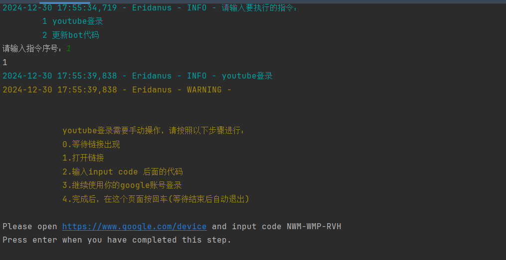

# Youtube相关功能
## 完成登录认证
因为反爬的原因，需要使用你的youtube账号(一般也是google账号)，才能确保此类功能正常使用。

`config/api.yaml`
### 配置代理
```yaml
proxy:
  http_proxy: ""   #填写你的代理地址
  socks_proxy: ""
```
### 登录
使用【工具脚本.bat】即tool.py完成登录

运行之后，按提示操作。

登录后的一段时间内，你可以顺利地使用asmr以及youtube相关功能。
如果过了一段时间，你不能用这个功能了，就需要重新登录。

## 随机asmr
请确保已完成登录认证
### 触发方式
```yaml
随机奥术
随机奥数
随机asmr
```
如果你开启了【函数调用】，你可以直接告诉bot你想听asmr。
### 配置频道
配置所使用的频道`config/api.yaml`
```yaml
youtube_asmr:
  send_type: file   #record或者file，record是语音，file是文件
  channels:      #频道来源。此功能需要配置proxy，并通过tools完成登录。
    - '@emococh'
    - '@-gabisroom-4153'  #以此类推，你可以增加更多频道
```
## 下载youtube视频
```yaml
/yt音频{视频链接}  #获取指定视频的音频文件，比如 /yt音频https://youtu.be/L229QDxDakU?si=D3_oxY-ghnUeGO7s
```
## 下载youtube音频
```yaml
/yt视频{视频链接}  #获取指定视频的音频文件，比如 /yt视频https://youtu.be/L229QDxDakU?si=D3_oxY-ghnUeGO7s
```
