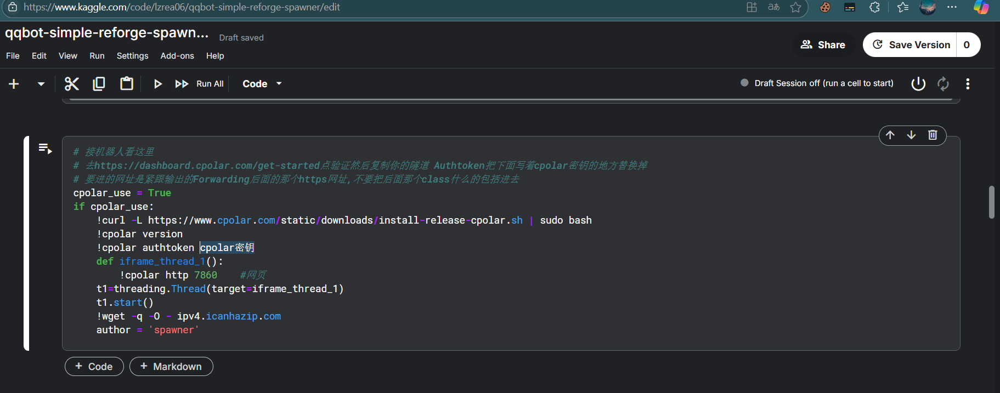
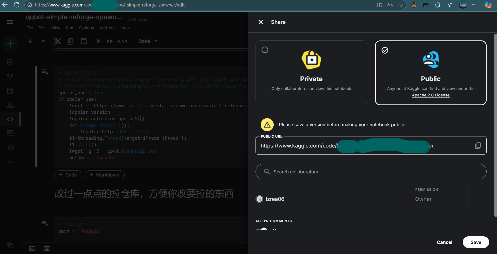

# AI绘画
## 接入你自己的sd
配置文件`config/api.yaml`
```yaml
ai绘画:
  sdUrl: '' #你自己搭建的sd，地址，示例http://127.0.0.1:17858（示例≠你能直接填示例用），部署https://www.bilibili.com/video/BV1iM4y1y7oA/
  sd审核和反推api: ''        # 如果你的sd有反推插件https://github.com/spawner1145/stable-diffusion-webui-wd14-tagger.git，可以直接使用你的sdurl的api
  nai_key: ''
```
## 指令
### novel_ai绘图指令
```yaml
n4 prompt  #比如 n4 an anime girlish
n3 prompt  #比如 n3 an anime girlish
# 在prompt中随便一个地方加入横或方就会变成画横图和方图，默认竖图
```
### sd绘图指令
```yaml
画 xxxxx
```
### tag反推
```yaml
tag
```
然后发送图片
### 重绘
```yaml
重绘 prompt   #比如 重绘 1girl,solo,loli
```
然后发送图片
### 指令设置参数
```yaml
setsd xxxx   #设置sd参数(比如setsd -w1024 -h1600就会把宽设为1024，高设为1600)
setre xxxx   #设置重绘参数
```
### 模型查询指令
```yaml
lora
ckpt 
```
### 切换模型
```yaml
ckpt2 {modelname}
```
### 查询danbooru词条
```yaml
dan {你要查的tag，可以是各种语言}
```
### 获取抽卡可用词条(具体用法后面会讲)
```yaml
getwd
```
## kaggle部署ai绘画(必看)
下面的教程将带你实现白嫖kaggle的gpu资源。

【inspired by [spawner](https://www.kaggle.com/spawnerqwq)】
### kaggle注册登录
[kaggle](https://www.kaggle.com/code/spawnerqwq/qqbot-simple-reforge-spawner)

记得**绑定手机号**，不然用不了gpu和联网。

`在profile界面。`
### cpolar注册
去[cpolar](https://dashboard.cpolar.com/get-started)注册(选免费套餐)，然后点验证，复制你的隧道 Authtoken

记录你的cpolar密钥 即隧道AuthToken，比如`YTMgojjgnagtnbvjppf`(这是我乱打的，你并不能偷懒直接拿去用)
### kaggle脚本修改
打开[spawner的脚本](https://www.kaggle.com/code/spawnerqwq/qqbot-simple-reforge-spawner)，点击白色的copy&edit，跳转到新页面后往下划拉。

(这里其他人的脚本理论上也可以用)

把图中的`cpolar密钥`换成你上面申请的隧道AuthToken，看起来应该是这样
```python
cpolar_use = True
if cpolar_use:
    !curl -L https://www.cpolar.com/static/downloads/install-release-cpolar.sh | sudo bash
    !cpolar version
    !cpolar authtoken YTMgojjgnagtnbvjppf
    def iframe_thread_1():
        !cpolar http 7860    #网页
    t1=threading.Thread(target=iframe_thread_1)
    t1.start()
    !wget -q -O - ipv4.icanhazip.com
    author = 'spawner'
```
### 设为公开脚本
点击页面右上角的share，将脚本设置为公开，这是为了其他账号能够正常访问。

**记录下这里的public url**，然后点击save。
```yaml
https://www.kaggle.com/code/xxxx/qqbot-simple-reforge-spawner
```
这个【分享链接】我们待会会用到。
### 为持久化运行做准备
注册更多账号，记录好账号密码。

**你注册的所有账号都需要能够通过 email+密码 登录，并且完成了手机号验证**

验证码部分你可以找接码平台。
## 部署Achernar
[Achernar](https://github.com/avilliai/Achernar)

Achernar是Eridanus的派生项目。参照readme.md部署。

### 编辑Achernar配置文件
`Achernar/config.yaml`
```yaml
proxy: ""     #没用，不用管这一项
port: 3529
headless: true #是否开启浏览器无头模式，低配服务器建议开启。
#在shared_notebook填入记录的你的【分享链接】
shared_notebook: ""
enable_kaggle_extension: true
enable_cpolar_extension: true
cpolar_check_interval: 360
kaggle_change_account_interval: 36000

kaggle_accounts:
  - email: "你的邮箱"
    password: "你的密码"
  - email: "你的第二个邮箱"
    password: "你的第二个密码"  #以此类推
cpolar:
  email: "cpolar的邮箱"
  password: "cpolar的密码"

```
**运行Achernar主程序**

(有条件的话，建议开启代理，并设置为pac模式/规则代理模式，将有助于稳定运行。)
### 配置Eridanus
`config/api.yaml`
```yaml
ai绘画:
  sdUrl: "http://127.0.0.1:3529" 
  sd审核和反推api: "http://127.0.0.1:3529"
  nai_key: ""
```
重启Eridanus以重载配置文件。 

至此，在Achernar获取到隧道地址且自动脚本完全启动后(大概需要十分钟)，你应该已经可以在群里使用
```yaml
画 xxx #根据指定prompt生成图片
tag    #反推图片prompt
```

## 高级用法
### 关于抽卡(wildcard)功能
```yaml
getwd
```
可以获得所有能够抽取的wildcard

#### 注意:后面的wd指令是当作提示词用的
```yaml
<wda:x=y>
```
此指令会固定从名为x的wildcard中抽取y项，附加a的固定权重

```yaml
<wda-b:x=y>
```
此指令会从名为x的wildcard中抽取y项，附加a到b范围内的随机权重
如果权重参数（a-b或a）出现问题，默认为权重范围0到1

举例：
```yaml
画 1girl,<wd1:artist=1> # 随机抽一个画师，权重为1，例如wlop
画 1girl,<wd1:artist=2> # 随机抽两个画师，权重为1，例如wlop,torino aqua
画 1girl,<wd0.5:artist=2> # 随机抽两个画师，权重为0.5，例如(wlop:0.5),(torino aqua:0.5)
画 1girl,<wd0.4-0.5:artist=3> # 随机抽3个画师，权重为0.4到0.5中的随机数，例如(a:0.4111),(b:0.4231),(c:0.4342)
画 1girl,<wd1:artist=2>,<wd0.6:artist=3> # 随机抽五个画师，两个权重为1，三个权重为0.6
```

### 关于kaggle笔记本的lora和大模型下载
打开[c站civitai](https://civitai.com/)
注册一个账号（这个网站要梯子）
登录以后右上角点头像，点齿轮的那个图标
往下滑，你会看到API KEYS

创建一个api key，记住，待会要用（注意不是让你取的名字），比如说我搞了一个api key为aeb1d64b7c43f84ed1a131ba5bb9b40d（这个不是真的）
回到你的kaggle笔记

这个单元格里面全是下载链接
我们以大模型下载为示例
找到sd_model_urls

去c站找你要的模型，我们先随便找一个模型，比如[NoobAI-XL (NAI-XL)](https://civitai.com/models/833294/noobai-xl-nai-xl)
你会发现一个大大的下载按钮(不是create！)，这时我们对它右键
你会看到复制链接，就像https://civitai.com/api/download/models/1190596?type=Model&format=SafeTensor&size=full&fp=bf16
这时候我们要用上我们刚才获得的api key，把网址变成https://civitai.com/api/download/models/1190596?type=Model&format=SafeTensor&size=full&fp=bf16&token=aeb1d64b7c43f84ed1a131ba5bb9b40d（这个token是假的）
可以发现，我们在原网址后面加了一个&token=你的api key，把它变成了一个新网址
回到你的kaggle脚本，把这个新网址加进去(注意英文引号和逗号必须加)

现在你的sd就可以用这些模型了，lora这种也是一样的，不过注意只有c站后面需要加token参数，如果你从别的网站链接下载，直接把链接搞过来就行

在这里你可以更改你默认启动加载的模型和一些别的启动参数，自己探索吧

