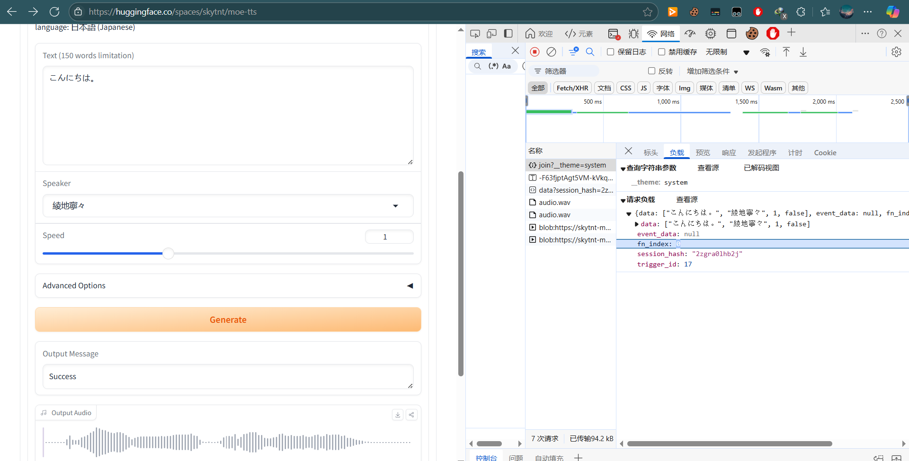

# 文本转语音
将文字转换为语音。语音功能可能需要安装ffmpeg并配置环境变量，Eridanus交流群(913122269)中有其他开发者制作的一键安装工具，当然你也可以自己安装，相关教程很容易就能搜索到。
## 使用方式
```yaml
/xx说xxxx           #比如 /派蒙说该死的旅行者
可用角色
```
## 进阶——函数调用
tts部分支持函数调用，当config/api.yaml配置了对话模型并启用了函数调用
```yaml
llm:
  func_calling: True #是否开启函数调用功能
```
你可以使用灵活的触发方式。
```yaml
@bot 用xx的声音说该死的旅行者
@bot 用语音说早上好，你吃饭了吗   #是的，你可以不传入speaker
@bot 发条语音听听              #是的，你可以不传入speaker和text
```
## 配置方式
### online_vits
在线vits语音合成

- 1.打开[在线合成](https://huggingface.co/spaces/skytnt/moe-tts)，
- 2.选择你的要用的模型和speaker
- 3.按f12打开开发者工具，切换到网络(network)页面
- 4.点击Generate
- 5.找到右侧出现的`join?__theme=system`，点击负载
- 6.记录fn_index和speaker

在`config/api.yaml`中配置
```yaml
tts:
  tts_engine: online_vits    #选择使用的语音合成引擎，可选napcat_tts/acgn_ai/vits(在群内下载整合包)，配了哪个填哪个。
  lang_type: "ja"  #自动转换语言类型,ja或zh，online_vits基本只支持ja。
  online_vits:
    speaker: "綾地寧々"
    fn_index: 0
```
### modelscope_tts

```yaml
tts:
  tts_engine: modelscope_tts
  modelscope_tts:
    speaker: "东雪莲"
```
### vits
低占用，含模型整合包体积较大，需要单独下载。
- [整合包google drive源](https://drive.google.com/file/d/1Cn_1UAdxvgLo1jv22SxNX-W5NKQkcyF5/view?usp=drive_link)
- [整合包github release源](https://github.com/avilliai/vits_api/releases)
- [整合包腾讯微云源](https://share.weiyun.com/fsR6KpIz)

最新版整合包应该已经解决了不兼容某些模型的问题。
```yaml
tts:
  tts_engine: vits     #选择使用的语音合成引擎，可选napcat_tts/acgn_ai/vits(在群内下载整合包)，配了哪个填哪个。
  vits:               #本地语音合成，配置要求极低，服务端整合包请在q群913122269下载
    lang_type: "ja"
    speaker: "綾地寧々"
    base_url: "http://127.0.0.1:5009"
```
所有可选speaker在运行 vits整合包服务端后可见。后面会出训练教程

在voiceModel文件夹下，新建文件夹，比如`YuzuSoft`，把下载的模型(xxx.pth)和配置文件(config.json)放进去，每个文件夹仅可放置一对模型和配置文件。
- [更多模型1](https://www.alipan.com/s/Yxh2gXvQpCU)
- [更多模型2](https://huggingface.co/spaces/skytnt/moe-tts)
### acgn_ai(已不推荐)
在https://getkey.acgnai.top/ 注册后，登录获取令牌，填入config/api.yaml的tts.acgn_ai.token字段。
```yaml
tts:
  tts_engine: acgn_ai     #选择使用的语音合成引擎，可选napcat_tts/acgn_ai，配了哪个填哪个。
  acgn_ai:
    token: "填入你自己的token"             #https://getkey.acgnai.top/注册后，登录获取令牌
    speaker: "玲可【星穹铁道】"
  napcat_tts:
    character_name: "酥心御姐"
```
### napcat_tts
仅napcat用户可用。

`config/api.yaml`
```yaml
tts:
  tts_engine: napcat_tts     #选择使用的语音合成引擎，可选napcat_tts/acgn_ai，配了哪个填哪个。
  acgn_ai:    #用napcat_tts就不要管acgn_ai相关配置了。
    token: ""             #不用填
    speaker: "玲可【星穹铁道】"           #不用动
  napcat_tts:
    character_name: "酥心御姐"
```
`config/basic_config.yaml`
```yaml
group:
  test_group: 879886836   #测试群号1，随便建个小群。bot会往里面发乱七八糟的东西，不要填用户群。
```
随便创一个小群把bot拉进去，然后填那个群的群号，这个群将作为消息中转使用。
